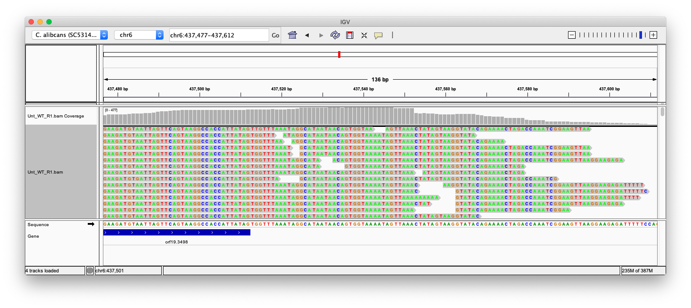

## Linear models

```{r, include=F}
knitr::opts_chunk$set(fig.width=5, fig.height=5)
```

"linear model" "general linear model" "linear predictor" "regression" "multiple regression" "multiple linear regression" "multiple linear regression model"

<br/>

Learn to predict a response variable as

* a straight line relationship with a predictor variable
* or more than one predictor variable
* actually it doesn't have to be a straight line
* some of the predictors could be categorical (ANOVA)
* and there could be interactions

<br/>

* test which variables and interactions the data supports as predictors
* give a confidence interval on any estimates

<br/>

* meet many ideas that form the basis of machine learning and statistics


## Linear models in R

<div style="float: right; width: 25%; padding 2em;">
```{r echo=F,out.width="100%",fig.align="left"}
knitr::include_graphics("../figures/chambers_and_hastie.jpg")
```
</div>

Many features of the S language (predecessor to R) were created to support working with linear models and their generalizations:

<br>

>* `data.frame` type introduced to hold data for modelling.

>* `factor` type introduced to hold categorical data.

>* `y ~ x1+x2+x3` formula syntax specify terms in models.

>* Manipulation of "S3" objects holding fitted models.

>* Rich set of diagnostic visualization functions.

<br>

Primary reference is "Statistical models in S".


## Linear maths and R

<!--
Will give everything today in English, in maths, and in R code.
-->

We will be using vectors and matrices extensively today.

In mathematics, we usually treat a vector as a matrix with a single column. In R, they are two different types. <span class="tip">*<span class="tiptext">R also makes a distinction between `matrix` and `data.frame` types. There is a good chance you have used data frames but not matrices before now.<br><br>Matrices contain all the same type of value, typically numeric, whereas data frames can have different types in different columns.</span></span>

A matrix can be created from a vector using `matrix`, or from multiple vectors with `cbind` (bind columns) or `rbind` (bind rows), or from a data frame with `as.matrix`.

Matrix transpose exchanges rows and columns. In maths it is indicated with a small t, eg $X^\top$. In R use the `t` function, eg `t(X)`.

$$
X = \begin{bmatrix} 1 & 4 \\ 2 & 5 \\ 3 & 6 \end{bmatrix} 
\quad \quad X^\top = \begin{bmatrix} 1 & 2 & 3 \\ 4 & 5 & 6 \end{bmatrix} 
$$

## Dot products

"dot product" "weighted sum" "linear combination" "linear function" ...

Taking the **dot product** of two vectors we multiply corresponding elements together and add the results to obtain a total.

In mathematical notation:

$$
a^\top b = a_1 b_1 + a_2 b_2 + \dots + a_n b_n
$$

In R:

```{r eval=F}
sum(a*b)
```


## Dot products and geometry

<div style="float: left; width: 25%; padding: 2em">
The dot product is our ruler and set-square.

```{r echo=F,out.width="100%",fig.align="left"}
knitr::include_graphics("../figures/Triangle-Ruler.png")
```
</div>

### Lengths

A vector can be thought of as an arrow in a space.

The dot product of a vector with itself $a^\top a$ is the square of its length. 
<br>= Pythagoras, but in as many dimensions as we like.
<br>= Euclidean distance (squared).

### Right angles

Two vectors at right angles have a dot product of zero. They are **orthogonal**.


## Matrix vector multiplication

Taking the product of a matrix $X$ and a vector $a$ with length matching the number of columns, the result is a vector containing the dot product of each row of the matrix $X$ with the vector $a$:

$$
Xa =
\begin{bmatrix}
x_{1,1} a_1 + x_{1,2} a_2 + \dots \\
x_{2,1} a_1 + x_{2,2} a_2 + \dots \\
\vdots
\end{bmatrix}
$$

Equivalently, it's a weighted sum of the columns of $X$:

$$
Xa = 
a_1
\begin{bmatrix}
x_{1,1} \\
x_{2,1} \\
\vdots
\end{bmatrix}
+ a_2
\begin{bmatrix}
x_{1,2} \\
x_{2,2} \\
\vdots
\end{bmatrix}
+
\dots
$$

In R:

```{r eval=F}
X %*% a
```

<br>
(Can also multiply two matrices with `%*%`. We won't need this today.)


## Geometry -- subspaces
<div style="float: right">
*Example: a 3x2 matrix puts<br>2D vectors into a 2D subspace in 3D.*

```{r echo=F,warning=F,message=F, fig.width=2, fig.height=4}
library(plot3D)
x <- seq(-3,3,by=1)
y <- seq(-3,3,by=1)
m <- mesh(x,y)
z <- m$x + m$y
op <- par(mfrow=c(2,1), mar=c(1,1,1,1))
plot(m$x, m$y, xlab="", ylab="", xaxt="n", yaxt="n")
surf3D(m$x,m$y,z,border="black",col="#00aacc",colvar=NA,bty="f")
par(op)
```
</div>

> * A line in two or more dimensions, passing through the origin.
> * A plane in three or more dimensions, passing through the origin.
> * A point at the origin.

These are all examples of **subspaces**.

Think of all the vectors that could result from multiplying a matrix $X$ with some arbitrary vector. 

If the matrix $X$ has $n$ rows and $p$ columns, we obtain an (at most) $p$-dimensional **subspace** within an $n$-dimensional space.

A subspace has an **orthogonal subspace** with $n-p$ dimensions. All the vectors in a subspace are orthogonal to all the vectors in its orthogonal subspace.


##

Do section: Vectors and matrices


## Models

A **model** can be used to predict a **response** variable based on a set of **predictor** variables. <span class="tip">*<span class="tiptext">Alternative terms: dependent variable, independent variables.<br><br>We are using causal language, but really only describing an association.<br><br><br>If the data is from an <b>experiment</b>, you can usually interpret an association between your treatment and outcome as causation.<br><br>If your data is <b>observational</b>, you <i>may</i> be able to infer causation, after making some assumptions, using causal theory that is well beyond this workshop (see Judea Pearl, Donald Rubin).</span></span>


The prediction will usually be imperfect, due to random noise.

<br>


## Linear model

A **response** $y$ is produced based on $p$ **predictors** $x_j$ plus noise $\varepsilon$ ("epsilon"):

$$ y = \beta_1 x_1 + \beta_2 x_2 + \dots + \beta_p x_p + \varepsilon $$

The model has $p$ **terms**, plus a noise term. The model is specified by the choice of **coefficients** $\beta$ ("beta").

This can also be written as a dot product:

$$ y = \beta^\top x + \varepsilon $$

<br>

The noise is assumed to be normally distributed with standard deviation $\sigma$ ("sigma") (i.e. variance $\sigma^2$):

$$ \varepsilon \sim \mathcal{N}(0,\sigma^2) $$

<br>

Typically $x_1$ will always be 1, so $\beta_1$ is a constant term in the model. We still count it as one of the $p$ predictors. <span class="tip">*<span class="tiptext">This matches what R does, but may differ from other presentations!</span></span>


## Linear model in R code

For vector of coefficients `beta` and vector of predictors in some particular case `x`, the most probable outcome is:

```{r eval=F}
y_predicted <- sum(beta*x)
```

A simulated possible outcome can be generated by adding random noise:

```{r eval=F}
y_simulated <- sum(beta*x) + rnorm(1, mean=0, sd=sigma)
```

But where do the coefficients $\beta$ come from?


## Model fitting -- estimating $\beta$

Say we have observed $n$ responses $y_i$ with corresponding vectors of predictors $x_i$: 

$$ 
\begin{align}
y_1 &= \beta_1 x_{1,1} + \beta_2 x_{1,2} + \dots + \beta_p x_{1,p} + \varepsilon_1 \\
y_2 &= \beta_1 x_{2,1} + \beta_2 x_{2,2} + \dots + \beta_p x_{2,p} + \varepsilon_2 \\
    & \dots \\
y_n &= \beta_1 x_{n,1} + \beta_2 x_{n,2} + \dots + \beta_p x_{n,p} + \varepsilon_n 
\end{align}
$$

This is conveniently written in terms of a vector of responses $y$ and matrix of predictors $X$:

$$ y = X \beta + \varepsilon $$

Each response is assumed to contain the same amount of noise:

$$ \varepsilon_i \sim \mathcal{N}(0,\sigma^2) $$

## Model fitting -- estimating $\beta$ with geometry

<div style="float: right">
```{r echo=F,fig.width=3,fig.height=3,animation.hook="gifski", interval=0.1}
for(t in 1:40) {
    par(mar=c(0,0,0,0))
    plot(0,type='n',axes=FALSE,ann=FALSE, 
         xlim=c(1,7), ylim=c(1,7), asp=1)

    o <- sin(t/40*2*pi)*0.75

    for(i in 10:1) {
        br = floor(127+128*i/10)
        rad = qnorm(0.5+0.5*i/11) * 20
        points(4+o,4+o, pch=21,cex=rad,col=NA,bg=sprintf("#%02x%02x%02x",br,br,255))
    }

    points(3,5, pch=21,bg="white")
    points(4+o,4+o, pch=21,bg="grey")
    arrows(4+o,4+o, 3,5, length=0.1)

    text(3.5+o/2, 4.5+o/2, adj=c(-1.0,-0.5), expression(hat(epsilon)))
    text(3,5, adj=c(0,-0.75), "y")
    text(4+o,4+o, adj=c(0,1.25), expression(Chi * hat(beta)))
}
```
</div>

$$ y = X \beta + \varepsilon $$
$$ \varepsilon_i \sim \mathcal{N}(0,\sigma^2) $$

**Maximum Likelihood**<span class="tip">*<span class="tiptext">"Likelihood" has a technical meaning in statistics: it is the probability of the *data* given the model parameters. This is backwards from normal English usage.</span></span> estimate:<br>
We choose $\hat\beta$ to maximize the likelihood of $y$.

A very nice consequence of assuming normally distributed noise is that the vector $\varepsilon$ has a spherical distribution, so the choice of $\hat\beta$ making $y$ most likely is the one that places $X \hat\beta$ nearest to $y$.

$$ \hat \varepsilon = y - X \hat \beta $$

The length of $\hat \varepsilon$, which we seek to minimize, is the square root of the sum of squares of its elements $\hat \varepsilon^\top \hat \varepsilon$. So this is also called a **least squares** estimate.


<br>
<div style="font-size: 60%;">
(This is *one route* to least squares. [Looser assumptions about noise still lead to least squares](https://en.wikipedia.org/wiki/Gauss%E2%80%93Markov_theorem), so long as there aren't wild outliers.)</div>


## Model fitting in R with `lm( )`

Our starting point for modelling is usually a data frame, but the process of getting $y$ and $X$ from the data frame has some complications, and a special "formula" syntax. 

<div style="margin: 3em;">
data frame
            
<span style="font-size: 300%;">&nbsp;&darr;&nbsp;</span> 
<span style="font-size: 75%">Weirdness involving "~" formula syntax happens.</span>

&nbsp;&nbsp;y, X

<span style="font-size: 300%;">&nbsp;&darr;&nbsp;</span>
<span style="font-size: 75%">Actual magic of model fitting happens.</span>

coef, sigma
</div>

First look at examples then discuss process in detail.

##

Do section: Single numerical predictor


## Formula syntax introduction

We've just seen the formula

`height ~ age`

> * Left hand side specifies response $y$.
> * Right hand side specifies model matrix $X$.

Terms refer to columns of a data frame or variables in the environment.

There are some rules to learn about the construction of $X$.


## Formula syntax -- intercept term

From the formula `height ~ age`, X had *two* columns. What gives? 

Intercept term `1` is implicit (predictor consisting of all 1s). 

> * `height ~ 1 + age` to be explicit.

Omit with `-1` or `0`. 

> * `height ~ 0 + age` to force a model where newborns are 0cm tall.


## Formulas -- factors

Factors in R represent categorical data, such as treatment groups or batches in an experiment.

R converts a factor into $n_\text{levels}-1$ columns of "indicator variables", aka "one-hot" encoding. <span class="tip">\*<span class="tiptext">The fundamental issue here is that we can't estimate the coefficients in a model that has both a baseline effect and effects of each level of the factor. R's solution is to treat the first level as the baseline. This won't affect the predictions the model makes, but we need to be careful interpreting the coefficients.<br/><br/>The encoding of factors can be adjusted using the `C()` function within a formula. The default differs between S and R languages!</span></span>

```{r}
f <- factor(c("a","a","b","b","c","c"))

model.matrix(~ f)
```

## Formulas -- factors

Need to be careful interpreting the meaning of coefficients for factors.

> * `(Intercept)` is the mean for "a".
> * `fb` is the *step* from "a" to "b".
> * `fc` is the *step* from "a" to "c".

```{r}
f <- factor(c("a","a","b","b","c","c"))

model.matrix(~ f)
```

## Formulas -- factors without the intercept term

R tries to be clever about factor encoding if the intercept is omitted.

Without an intercept, each coefficient is simply the mean for that level. 

Can't do this with multiple factors at once.<span class="tip">*<span class="tiptext">Without the intercept term, R will only do this for the first factor. Further factors are encoded as before, omitting the first level. If R didn't do this, there would be multiple choices of coefficients able to make the exact same prediction (the predictors would not be linearly independent).</span></span>

```{r}
f <- factor(c("a","a","b","b","c","c"))
```

<div style="float: left; width: 15em;">
```{r}
model.matrix(~ f)
```
</div>

<div style="float: left; width: 15em;">
```{r}
model.matrix(~ 0 + f)
```
</div>


## 

Do section: Single factor predictor, two levels


## Model fitting -- estimating $\beta$ with geometry

<div style="float: right; width: 15em;">
Imagine an experiment in which two noisy measurements of something are made.

Imagine many runs of this experiment.

The runs form a fuzzy circular cloud around the (noise-free) truth.
</div>

```{r echo=F}
source("../diagram.R")
begin()
many_exp()
the_truth()
```

## Model fitting -- estimating $\beta$ with geometry

```{r echo=F}
begin()
one_exp()
```


## Model fitting -- estimating $\beta$ with geometry

<div style="float: right; width: 15em;">
```{r}
y <- c(3,5)
fit <- lm(y ~ 1)

coef(fit)
predict(fit)
residuals(fit)
```
</div>

```{r echo=F}
begin()
to_predict()
```

## Model fitting -- estimating $\sigma$

```{asis}
<div style="float: right; width: 15em;">
The coefficient is wrong, but is our best estimate. It is an unbiassed estimate.

The residuals vector must be orthogonal to the subspace of possible predictions so it is too short, but we can correct for this to get an unbiassed estimate of the variance.
<span class="tip">*<span class="tiptext">In R, this is done using QR decomposition. X is decomposed into $X=QR$ with $Q$ orthonormal (i.e. a rotation matrix). $Q^{\top}y$ rotates $y$ so that the first $p$ elements contain all the information relevant to fitting the model, and the remaining $n-p$ elements are purely noise.<br><br>The first $p$ elements of $Q^{\top}\hat{\varepsilon}$ will be zero due to fitting the model, but the remaining $n-p$ elements are unaffected by this and as this is a rotation of a spherically symmetric noise distribution they have the same variance as the original elements of $\varepsilon$.</span></span>


$$ \hat \sigma^2 = { \hat\varepsilon^\top \hat\varepsilon \over n-p } $$
```

```{r}
df.residual(fit)  # n-p
sigma(fit)
```
</div>

```{r echo=F}
begin()
to_predict()
the_truth()
```


## Testing hypotheses

<div style="float: right; width: 15em;">
```{r}
y <- c(3,5)
fit0 <- lm(y ~ 0)
fit1 <- lm(y ~ 1)
```

Two model formulas representing null hypothesis H0 and alternative hypothesis H1.

**H0 must *nest* within H1. Usually this means H1 has all of the predictors in H0, plus a few more.**

<br>

$\hat\varepsilon_0$ can't be shorter than $\hat\varepsilon_1$

Is it *surprisingly longer*? Then we reject H0.
</div>

```{r echo=F}
begin()
to_test()
```

## Testing hypotheses

<div style="float: right; width: 15em;">
```{r}
y <- c(3,5)
fit0 <- lm(y ~ 0)
fit1 <- lm(y ~ 1)

anova(fit0, fit1)
```

Here we can not reject the null hypothesis (F(1,1)=16, p=0.156). <span class="tip">*<span class="tiptext">If H0 is true, we expect F to be close to 1. This value of F is much larger than 1. Why can't we reject H0? The problem is that we are very uncertain about $\sigma$ because our residual degrees of freedom is so low. Hence the F(1,1) distribution here has a very long fat tail.</span></span>
</div>

```{r echo=F}
begin()
to_test()
```

## Testing hypotheses -- details

<div style="float: right; width: 15em">
```{r}
df0 <- df.residual(fit0)       # n-p0
RSS0 <- sum(residuals(fit0)^2)

df1 <- df.residual(fit1)       # n-p1
RSS1 <- sum(residuals(fit1)^2)

F <- (RSS0-RSS1)/(df0-df1) / (RSS1/df1) 
F
pf(F, df0-df1, df1, lower.tail=FALSE)
```


For low residual degrees of freedom $n-p_1$, large values of $F$ can still occur by chance, so our toy example is not statistically sigificant even with this large $F$ statistic.
</div>
$$
RSS_0 = \hat\varepsilon_0^\top \hat\varepsilon_0
$$
$$
RSS_1 = \hat\varepsilon_1^\top \hat\varepsilon_1
$$

<br>

$$
F = { {(RSS_0-RSS_1) / (p_1-p_0)} \over {RSS_1 / (n-p_1)} }
$$

RSS = Residual Sum of Squares

Is the increase in RSS in H0 merely proportionate 
<br>to the extra residual degree(s) of freedom? 

Then $F$ will be close to 1. 

<br>

<div style="font-size: 125%">`anova(fit0, fit1)`<br>handles all this for us.</div>


## A different way to test -- linear hypotheses

"linear hypothesis" "general linear hypothesis" "linear restriction" "contrast"

<br>
A **linear hypothesis test** tests an H0 in which some linear combination of coefficients in H1 is restricted to be zero.

<br>
From a linear combination of coefficients we obtain:

>* estimated value (calculated with dot product)
>* Confidence Interval (CI)
>* hypothesis test p-value

<br>
Examples:

>* a **contrast** compares specific levels of an experimental factor<span class="tip">*<span class="tiptext">Terminology is a little tricky here. The limma package refers to linear combinations in general as contrasts.</span></span>
>* the difference of response between two imagined individuals

<br>
Use `multcomp` package.


##

Do section: Multiple factors, many levels


## Nested models revision

To test our H0, it must nest within H1.

>* It must be possible for any set of predictions $X\beta$ from H0 also to be made by H1.

<br>

Testing linear restrictions using `glht` naturally obeys this, as the H0 is defined by restrictions on the coefficients of H1.

<br>

With the `anova` test, you need to ensure nesting yourself.

Generally we ensure this by making the predictors for H0 a subset of the predictors for H1.

>* Exactly equivalent to restricting the coefficients for these predictors to be zero, using `glht`.

<br>

**`anova` will not give an error if your models don't nest, but results will be invalid.**


## What is a p-value anyway?

**p-values can be viewed as a strength of evidence.** <br>
If H1 is true, $p$ heads to zero if there is a strong effect or lots of data. 

**p-values are a bit weird though.** <br>
If H0 is true, $p$ is a uniformly random number between 0 and 1. 

<br>
<br>

A p-value lets us choose our probability of falsely rejecting a true hypothesis ([type I error](https://en.wikipedia.org/wiki/Type_I_and_type_II_errors)).

If we decide to reject H0 when $p \leq 0.05$, we are guaranteed a probability of 0.05 of rejecting H0 if it is actually true.

<br>

But suppose we perform 20 such tests. There is a high chance of rejecting at least one true null hypothesis.

Need to adjust p-values for this problem (see `p.adjust`).


## Multiple testing

Suppose some set of null hypotheses are true. What chance do we run of rejecting one or more of them?

<div style="float: right; width: 25%; border: 1px solid #888; margin-top: 4em; padding: 0.5em">
**What if we have multiple hypotheses about the value of a single coefficient?**

Only one value can be true, so no problem!

&rarr; Reject all values outside a confidence interval.
</div>

### Family-Wise Error Rate (FWER) control

"*Any* false rejection will ruin my argument."

> * Tukey's Honestly Significant Differences
> * Bonferroni correction (etc)

### False Discovery Rate (FDR) control

"I can tolerate a certain *rate* of false rejections amongst rejected hypotheses."

> * Benjamini and Hochberg correction (etc)


## More on formulas

"Wilikins-Rogers notation"

Merely a convenience, if you already have model matrix `X` can just use `y ~ 0 + X`.

We've seen:

> * intercept term
> * numerical predictors
> * factor predictors
> * interactions between factors

Let's look at other things formula syntax can do.

## Formulas - data types

`numeric` vector is represented as itself.

`factor` is represented as $n_\text{levels}-1$ columns containing 1s and 0s. 

`logical` vector is treated like a factor with levels FALSE and TRUE.

`matrix` is represented as multiple columns.


## Formulas - calculations and function calls

Can calculate with function calls, or enclose maths in `I( )`.

Handy functions such as `poly` and `splines::ns` produce matrices for fitting curves.

```{r}
x <- 1:6
```

<div style="float: left; width: 15em;">
```{r}
model.matrix(~ x + I(x^2) + log2(x))
```
</div>

<div style="float: left; width: 15em;">
```{r}
model.matrix(~ poly(x,3))
```
</div>


## Formulas - interactions

`a:b` specifies an interaction between `a` and `b`. 

All pairings of predictors from the two terms are multiplied together.

For logical and factor vectors, this produces the logical "and" of each pairing.
<br>&nbsp;

<br>

```{r}
model.matrix(~ f + x + f:x)
```

## Formulas - interactions

`a*b` is shorthand to also include main effects `a + b + a:b`.

(More obscurely `a/b` is shorthand for `a + a:b`, if `b` only makes sense in the context of each specific `a`.)

<span style="display: inline-block; width: 6em">`(a+b+c)^2`</span> is shorthand for `a + b + c + a:b + a:c + b:c`.
<br>
<span style="display: inline-block; width: 6em">`a*b*c`</span> is shorthand for `a + b + c + a:b + a:c + b:c + a:b:c`.

<br>

```{r}
model.matrix(~ f*x)
```


##

Do section: Gene expression example


## Extensions to the idea of linear models

Linear models are a building block or basis for many more complex statistical models.

<br>

Of particular importance (in my opinion):

> * Generalized Linear Models
> * Linear Mixed Models
> * Screening many different response variables


## Generalized Linear Models (GLMs) 

<div style="float: right; width: 33%;padding-left: 2em">
**Example: count data**

> * Poisson distributed
> * $\text{Var}(Y) = \text{E}(Y)$

```{r echo=FALSE,fig.width=3,fig.height=2}
set.seed(1)
x <- seq(0,20,by=0.2)
y <- rpois(length(x), x)
par(mar=c(5,5,0.5,0.5))
plot(x,y,xlab="E(y)",ylab="y", cex=0.25)

fit <- lm(y~x)
plot(predict(fit),residuals(fit), cex=0.25)
```

</div>

**(Not covered today.)**

We are still trying to predict the mean value, but now the response has **a noise distribution that changes based on its mean value**.

> * The noise distributions are characterized by the mean-variance relationship.

We want to **fit the model on a transformed scale** even if the data contains values that can't be transformed.

Examples:

> * Fit a model on a log scale to count data that includes zeros using a *Poisson* or *negative-binomial GLM*.
> * Fit a model of the *log odds* of a binary outcome using *logistic regression*.

Fit using the function `glm`.

`emmeans` can also be used with these models!


## Linear Mixed Models

**(Not covered today.)**

The models we have fitted today contain only **fixed effects**.

A **mixed model** contains both **fixed effects** and **random effects**.

With a **random effect**, the levels of a factor represent individuals from some large population. 

Using random effects:

> * Lets us characterize a population. The model is not about *particular individuals*, but about *individuals randomly chosen from a large population*. How does an average individual behave, and what is the standard deviation?
> * Allows analysis of experiments with **nested factors**, such as repeated measurements (technical replicates).

Fit using a package such as `lme4`. See example code in workshop appendix.

`emmeans` can also be used with these models!


## Screening many responses

"High throughput" biological datasets we can view as containing many sets of responses.

Typical example is RNA-Seq gene expression.




## Screening many responses

"High throughput" biological datasets we can view as containing many sets of responses.

Typical example is RNA-Seq gene expression.

> * Perform RNA-Seq on a set of biological samples.
> * Number of RNA molecules seen for each gene in each sample is counted.

> * Linear model formula based on experiment design.
> * Each gene can be viewed as a separate set of responses.

<br>

Key features:

> * A test is performed for each gene. Multiple testing adjustment is crucial!
> * Residual standard deviation is similar between genes. "Empirical Bayes" shrinking of these standard deviations overcomes problems with small numbers of samples.

<br>

Use Bioconductor packages such as `limma` (fit many linear models) or `edgeR` (fit many GLMs).


## 

Do section: Testing many genes with limma


## Summary

We collect some **data** from the real world.

We **fit** the data, obtaining a **model**.

The model lets us **predict** responses for new individuals.

(We carefully check the model is doing a good job of this with existing data.)

The model lets us **estimate** quantities of interest and **test hypotheses**
<br>(with measures of uncertainty such as CIs and p-values).

*It is hard to overstate how enormously general and productive this way of doing things is.*


## Further reading

<div style="float: right; width: 25%; padding 2em;">
```{r echo=F,out.width="100%",fig.align="left"}
knitr::include_graphics("../figures/chambers_and_hastie.jpg")
```
</div>

**Primary reference is:**

Chambers and Hastie (1991) "Statistical Models in S"

<br>
**Also good:**

Faraway (2014) "Linear Models with R"

James, Witten, Hastie and Tibshirani (2013) "An Introduction to Statistical Learning"

Harrel (2015) "Regression Modeling Strategies"

McElreath's "Statistical Rethinking" videos and book

<br>
**See links on the workshop home page.**


## Extra slides

## Extensions to linear models

### Insufficient data or $p > n$

>* Regularization with ridge regression and/or LASSO: `glmnet::glmnet( )`
>* Partial Least Squares (PLS) <br>(pick best direction to start moving in and take best leap along it, repeat)
>* Principal Component Regression (PCR)<br>(direction of largest variation in X first)

### Noise not normal (eg binary or count data)

>* **Generalized Linear Models:** `glm( )`<br>(logistic regression, binomial, Poisson, negative binomial, gamma, etc)
>* Quasi-Likelihood F-test in case of over-dispersion

### Survival time, with censoring

>* Cox survival model: `survival::coxph( )`


## Extensions to linear models

### Noise at a coarser grain than single measurements

Individuals tracked over time, repeated measurements, blocks/batches/plots, etc.

>* **Linear Mixed Model** (some coefficients are drawn from a random distribution): `lme4`, `lmerTest`
>* Time series models.

### Noise in data is poorly understood, or possibly misspecified

>* Quantile regression may be more robust to outliers: `quantreg::rq( )` <br>(eg try to predict the median)
>* "Sandwich" estimator gives consistent estimates of standard error, even if variance is not uniform. 
>* "Bootstrapping" can estimate bias, provide confidence intervals for almost any method of estimation.


## Extensions to linear models

### Response is non-linear in predictors

>* Feature engineering: `poly( )`, `splines::ns( )`
>* Local regression (LOESS): `loess( )`
>* Generalized Additive Models (GAM): `mgcv::gam( )`<br>(splines with regularization)
>* Neural network<br>(many linear models connected with non-linear functions)

Also consider tree methods. Gradient boosted tree methods are unreasonably effective: `xgboost`


## $R^2$

"coefficient of determination"

<br>

**How much of the variation in the data is explained by a model?**

> * We can think of there being a pool of variance in the data, varying around the overall mean<span class="tip">*<span class="tiptext">If the model omits the intercept with `~0+...`, `summary( )` will instead view this pool of variance as varying around 0.</span></span>.

> * Our model explains some proportion of this variance, called $R^2$.

&nbsp;&nbsp;&nbsp;&nbsp; $TSS$ = Total Sum of Squares (vs mean)

&nbsp;&nbsp;&nbsp;&nbsp; $RSS$ = Residual Sum of Squares

$$
R^2 = \frac{TSS-RSS}{TSS}
$$

<br>

$R^2$ is reported by `summary( )` as "Multiple R-squared".


## $R^2$

"coefficient of determination"

<br>

With a single predictor, $R^2$ is exactly the squared Pearson correlation $r^2$.

See also standardized coefficients.

<br>

**Overfitting:**

Even a random predictor will allow a portion of the pool of variance to be removed.

> * Account for this using *adjusted* $R^2$, also reported by `summary( )`.

Coefficients are estimates, adding further error to predictions.

> * Estimate model performance by Cross Validation, or rank models by AIC.


