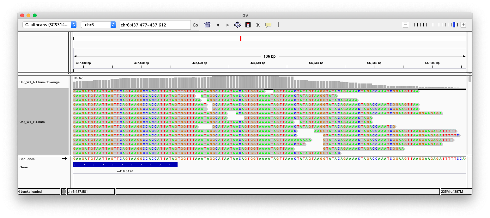

## Screening many responses

"High throughput" biological datasets we can view as containing many sets of responses.

Typical example is RNA-Seq gene expression.

## Screening many responses

"High throughput" biological datasets we can view as containing many sets of responses.

Typical example is RNA-Seq gene expression.

> * Perform RNA-Seq on a set of biological samples.
> * Number of RNA molecules seen for each gene in each sample is counted.

> * Linear model formula based on experiment design.
> * Each gene can be viewed as a separate set of responses.

 

Key features:

> * A test is performed for each gene. Multiple testing adjustment is crucial!
> * Residual standard deviation is similar between genes. "Empirical Bayes" shrinking of these standard deviations overcomes problems with small numbers of samples.

 

Use Bioconductor packages such as `limma` (fit many linear models) or `edgeR` (fit many GLMs).

